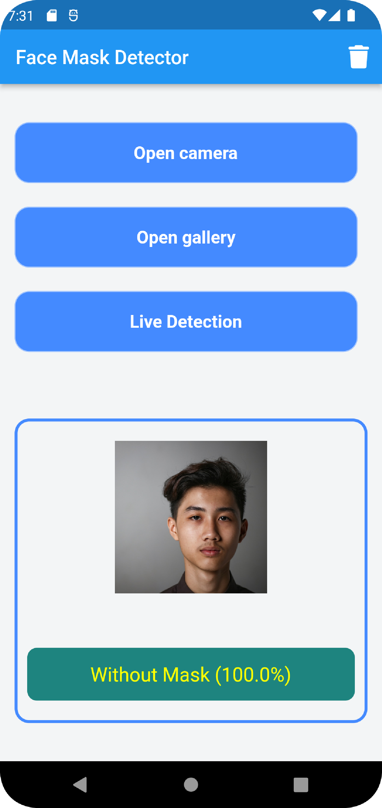

# Face Mask Detector App

Face Mask Detection mobile application built with Flutter and TensorFlow lite in order to detect face masks using images and live camera.


## :star: Features
 
* Detect mask on the live detectoin.
* Detect mask from a photo (camera or gallery)
## Installation

1- Install Packages

```bash
image_picker: pick image from gallery
https://pub.dev/packages/image_picker
```

```bash
tflite: run our trained model
https://pub.dev/packages/tflite
```

```bash
camera: get the streaming image buffers
https://pub.dev/packages/camera
```

2. Configure Project
Android
```bash
android/app/build.gradle

android {
    ...
    aaptOptions {
        noCompress 'tflite'
        noCompress 'lite'
    }
    ...
}

minSdkVersion 21
```
<br>

3. Train our model
```
* Download the dataset for training
    https://www.kaggle.com/prasoonkottarathil/face-mask-lite-dataset

* Training
    - go to https://teachablemachine.withgoogle.com to train our model
    - Get Started
    - Image Project
    - Edit `Class 1` for any Label(example `With_Mask`)
    - Edit `Class 2` for any Label(example `Without_Mask`)
    - Update image from dataset download above
    - Click `Train Model`(using default config) and waiting...
    - Click `Export Model` and select `Tensorflow Lite`
    - Download (include: *.tflite, labels.txt)
```
  * <a href='https://www.kaggle.com/prasoonkottarathil/face-mask-lite-dataset'>https://www.kaggle.com/prasoonkottarathil/face-mask-lite-dataset</a>
  * <a href='https://teachablemachine.withgoogle.com'>https://teachablemachine.withgoogle.com</a>
 <br>
4. Load model

```
loadModel() async {
    Tflite.close();
    await Tflite.loadModel(
        model: "assets/model/model.tflite", 
        labels: "assets/model/labels.txt",
        //numThreads: 1, // defaults to 1
        //isAsset: true, // defaults: true, set to false to load resources outside assets
        //useGpuDelegate: false // defaults: false, use GPU delegate
    );
  }
```
  <br>
5. <b> Logic for Run Model on Image from (Camera or Gallery). </b>

```
  _loadImage({required bool isCamera}) async {
    try {
      final XFile? image = await _picker.pickImage(
        source: isCamera ? ImageSource.camera : ImageSource.gallery,
      );
      if (image == null) {
        return null;
      }
      _image = File(image.path);
      _detectImage(_image!);
    } catch (e) {
      checkPermissions(context);
    }
  }
```
```
  _detectImage(File image) async {
    var recognitions = await Tflite.runModelOnImage(
      path: image.path,
      numResults: 2,
      threshold: 0.6,
      imageMean: 127.5,
      imageStd: 127.5,
    );
    setState(() {
      _loading = false;
      _recognitions = recognitions!;
      print(_recognitions[0]);
    });
  }
``` 

5. <b> Logic for Run Model on Image Stream (Live Detection). </b>


 <b> Global Variables</b>
```
  List<CameraDescription>? cameras; //Global Variable
  cameras = await availableCameras(); //init this in main before run app.
  ```
  <b> Live Detector Screen</b>
```
  CameraImage? cameraImage;
  CameraController? cameraController;
  String outPut = "";
  int selectedCamera = 0;

  _toggleCameras() async {
    setState(() {
      selectedCamera = selectedCamera == 1 ? 0 : 1;
    });
    _initCamera();
  }
  ```
  ```

  _initCamera() {
    cameraController =
        CameraController(cameras![selectedCamera], ResolutionPreset.max);
    cameraController!.initialize().then((value) {
      if (!mounted) {
        return;
      }
      setState(() {
        cameraController!.startImageStream((imageStream) {
          cameraImage = imageStream;
          _runModelOnFrame();
        });
      });
    });
  }

  ```
  ```

  _runModelOnFrame() async {
    if (cameraImage != null) {
      var recognitions = await Tflite.runModelOnFrame(
        bytesList: cameraImage!.planes.map((plane) {
          return plane.bytes;
        }).toList(),
        imageHeight: cameraImage!.height,
        imageWidth: cameraImage!.width,
        imageMean: 127.5,
        imageStd: 127.5,
        rotation: 90,
        numResults: 2,
      );
      for (var recognition in recognitions!) {
        outPut = recognitionResult(recognition);
        setState(() {});
      }
    }
  }
  
```
```
Output format:
  [{
    index: 0,
    label: "With_Mask",
    confidence: 0.989
  },...]

  Get the Output from this simple function:

    recognitionResult(recognition) {
    double confidence = (recognition['confidence'] * 100);
    var label = recognition['label'].split("_").join(" ");
    return "$label (${confidence.roundToDouble()}%)";
    }

  Output --> With Mask (100%)
```
## Screenshots
<br>
<table>
  <tr>
    <td></td>
    <td></td>
  </tr>
    <tr>
    <td></td>
    <td></td>
  </tr>
      <tr>
     <td></td>
    <td></td>
  </tr>
 </table>
 
 ## Download APK

<b> Download APK File and install it, Enjoy.</b>

[](https://www.dropbox.com/s/qwf67cwntwopbrr/face-mask-detector.apk?dl=0)

